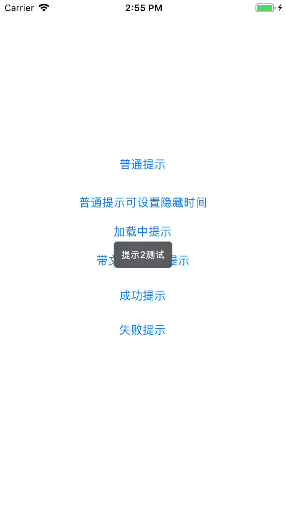
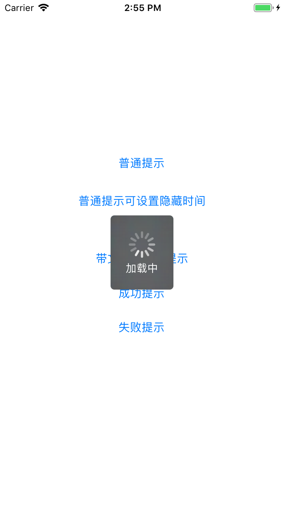
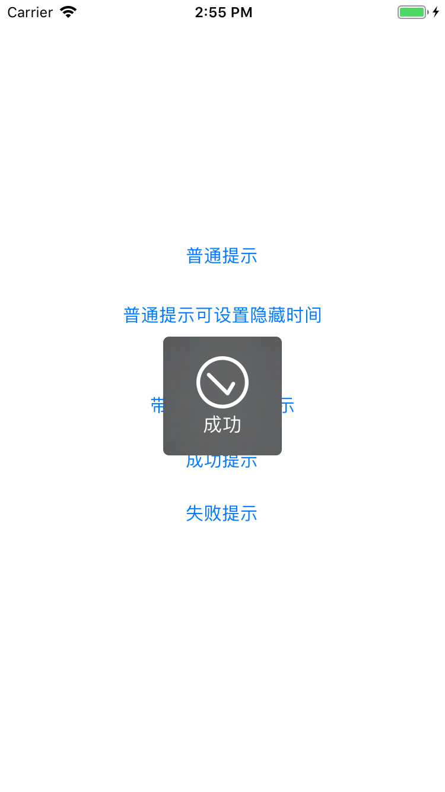

# KYProgressHUD

[](https://travis-ci.org/kyleboy/KYProgressHUD)
[](https://cocoapods.org/pods/KYProgressHUD)
[](https://cocoapods.org/pods/KYProgressHUD)
[](https://cocoapods.org/pods/KYProgressHUD)

对[MBProgressHUD](https://github.com/jdg/MBProgressHUD)的二次封装，提供便捷调用方法



## Example

To run the example project, clone the repo, and run `pod install` from the Example directory first.

```objc
- (IBAction)clickAction:(UIView *)sender {
    switch (sender.tag) {
        case 1:
            [MBProgressHUD showWithDetails:@"提示1测试"];
            break;
        case 2:
            [MBProgressHUD showWithDetails:@"提示2测试" afterDelay:1];
            break;
        case 3:
            [MBProgressHUD showMessage:@"" toView:nil];
            dispatch_after(dispatch_time(DISPATCH_TIME_NOW, (int64_t)(2 * NSEC_PER_SEC)), dispatch_get_main_queue(), ^{
                [MBProgressHUD hideHUD];
            });
            break;
        case 4:
            [MBProgressHUD showMessage:@"加载中" toView:nil];
            dispatch_after(dispatch_time(DISPATCH_TIME_NOW, (int64_t)(2 * NSEC_PER_SEC)), dispatch_get_main_queue(), ^{
                [MBProgressHUD hideHUD];
            });
            break;
        case 5:
            [MBProgressHUD showSuccess:@"成功"];
            break;
        case 6:
            [MBProgressHUD showError:@"失败"];
            break;
        
        default:
        break;
    }
}
```

## Requirements

## Installation

KYProgressHUD is available through [CocoaPods](https://cocoapods.org). To install
it, simply add the following line to your Podfile:

```ruby
pod 'KYProgressHUD'
```

## Author

kyleboy, kyleboy@126.com

## License

KYProgressHUD is available under the MIT license. See the LICENSE file for more info.
